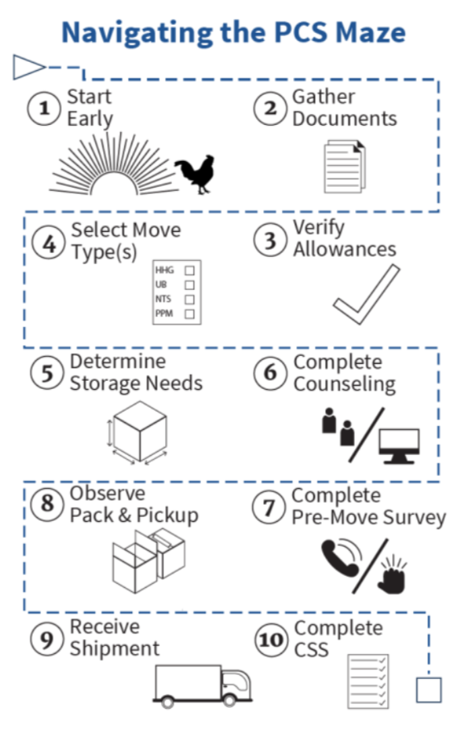

# Navigating the PCS Maze
### Helping you sail smoothly through your Permanent Change of Station (PCS)

## What is involved in a move?
As a military or civilian member of the U.S. Armed Forces, relocation becomes part of the routine. However, moving your family and belongings can be a complicated and stressful challenge. We are here to help!

## What is the PPO?
The Personal Property Office (PPO) is your one stop shop for all property movement and storage needs. At the PPO you can:
* Get assistance translating PCS orders into move options
* Apply for shipment and/or storage of your personal property
* Get support executing your Personally Procured Move (PPM)
* Submit paperwork relating to shipment or storage
* Request release of personal property from non-temporary storage (NTS)
* Get in-person or remote counseling assistance with move issues and shipment applications.

## Where is the nearest PPO?
You can locate your nearest PPO using the locator map link below. Enter your zip code and search.
* http://www.move.mil/resources/locator-maps

## What kind of moves does the PPO support?
* Household Goods (HHG)
* Unaccompanied Baggage
* Privately Owned Vehicle shipment/storage
* NTS
* PPMs
* Combination or Split Shipments * Boat or mobile home shipments.

## Who is my moving company?
Your moving company may go by different names, and may send different people for different parts of your move –- that's OK!

### Transportation Service Provider (TSP)
* The moving company officially assigned to you.
* TSPs are responsible for all aspects of your move, including hiring and managing the packers and drivers who handle your household goods.

### Origin Local Agent
* Hired by your TSP to pack and load your property at your current home.

### Linehaul Agent
* Hired by your TSP to drive your property from your origin to your destination.

### Destination Local Agent
* Hired by your TSP to unload and unpack your property at your new home.

### NTS TSP
* Coordinates the packing, loading, and storage of your household goods in non- temporary storage.

### Move Manager
* May be hired by your TSP to oversee the administrative aspects of your move.

### Third Party Claims Service
* May be hired by your TSP to oversee the claims process.

> ### Ultimately, your TSP listed in DPS is responsible for your move but can get help from other companies.

## What should I do if ...
### I need to change my dates?
* Call your TSP—their contact information is in Defense Personal Property System (DPS);
* Log in to DPS and change your dates and verify with your TSP; or
* Call your local PPO.

### My contact information changes?
* Update your contact information in DPS and verify with your TSP; or
* Request your local PPO to update your information.

### I’m having an issue with my moving company?
* Call quality assurance (QA) directly; or * Call your local PPO and ask for QA.

### My orders change?
* Contact your PPO as soon as possible.

### I need help not covered above?
* Contact your local PPO; or
* Check https://www.move.mil/ or the NAVSUP HHG website at https://www.navsup.navy.mil/public/navsup/hhg/home/

## We need (to find) you
During your move, accurate and up-to-date contact information is critical to ensure your move goes smoothly and problems are resolved quickly.

### Your PPO may need to:
* Ask you to re-sign a shipment application
* Notify you of pending expiration of NTS.

### Your moving company may need to:
* Call or email you to schedule a pre-move survey
* Notify you of estimated arrival time on pack/move day.

> ### Remember ... Everyone can see changes in DPS!

### To help us reach you:
* Keep your contact information up-to- date in DPS
* Have a plan for communicating internationally and in transit
* Provide primary and secondary means of communication
* Include a non-Department of Defense (DoD) email that you can check regularly.

## For further guidance
* Official DoD Moving Portal https://www.move.mil/
* PPO Locator http://www.move.mil/resources/locator-maps
